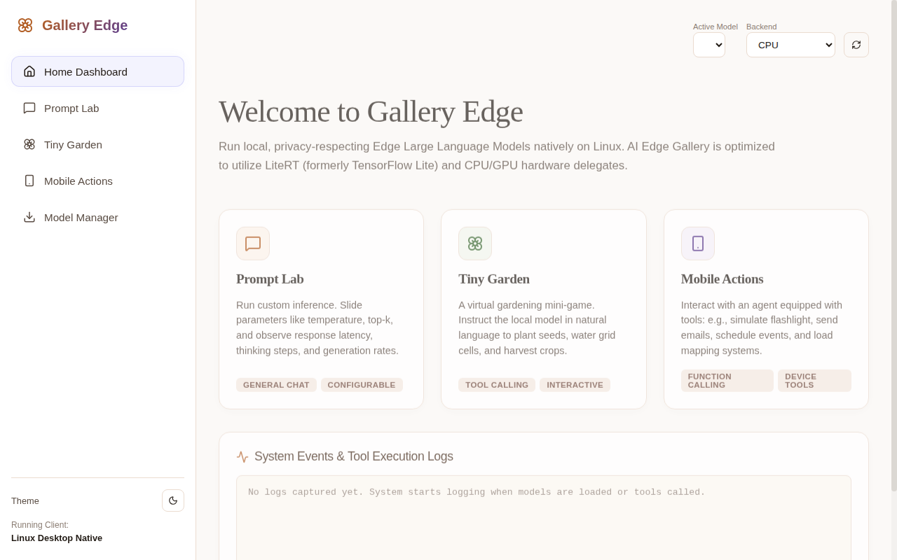

<div align="center">

# Google AI Edge Gallery

**A 1:1 Linux desktop replica of Google's on-device AI app — run LLMs locally, fully offline.**

<p>
  
  
  
  
  
  
</p>



</div>

---

## Features

- **Model Gallery** — Browse, download, and manage LiteRT models from Hugging Face
- **On-Device Chat** — Run LLMs locally with CPU or GPU acceleration
- **Tool Calling** — Built-in support for mobile actions & tiny garden toolsets
- **WebSocket Streaming** — Real-time token-by-token generation
- **Import Custom Models** — Bring your own `.tflite` models
- **Native Desktop Window** — pywebview native GUI with browser fallback
- **Debian Package** — One-click install via `.deb` ([download latest release](https://github.com/Deep007h/gallery-edge-project/releases))
- **Dark/Light Theme** — Toggle between warm cream or dark mode
- **Model Benchmarking** — Test model performance on your hardware

## Quick Start

### Option 1: Install via .deb (Debian/Ubuntu)

Download `gallery-edge_1.0.0_amd64.deb` from the [Releases page](https://github.com/Deep007h/gallery-edge-project/releases), then:

```bash
sudo dpkg -i gallery-edge_1.0.0_amd64.deb
gallery-edge
```

### Option 2: Run from source

```bash
# Backend
pip install -r requirements.txt
python main.py

# Frontend (development)
cd frontend
npm install
npm run dev
```

The app opens at `http://127.0.0.1:8000`.

## Project Structure

```
gallery-edge-project/
├── main.py                 # FastAPI server + WebSocket handler
├── models.py               # Model management (download, import, delete)
├── inference.py            # LiteRT inference engine & tool calling
├── test_engine.py          # Inference engine tests
├── model_allowlist.json    # Curated model registry
├── make_deb.sh             # .deb package builder script
├── frontend/               # Vite + React UI
│   ├── src/                # React components & styles
│   ├── dist/               # Built production assets
│   └── package.json
└── README.md
```

## API Endpoints

| Method | Endpoint | Description |
|--------|----------|-------------|
| GET | `/api/models` | List all available models |
| POST | `/api/models/download` | Start model download |
| POST | `/api/models/cancel` | Cancel active download |
| POST | `/api/models/delete` | Delete a downloaded model |
| POST | `/api/models/import` | Import a custom model |
| POST | `/api/models/set-token` | Set Hugging Face OAuth token |
| WS | `/ws` | WebSocket chat session |

## Tech Stack

- **Backend:** Python, FastAPI, LiteRT (AI Edge), Uvicorn
- **Frontend:** React 19, Vite, Lucide React Icons
- **Desktop:** pywebview (native window)
- **Packaging:** dpkg-deb (.deb)

## Why Gallery Edge?

- **100% Offline & Private** — All inference runs locally. Zero data leaves your machine.
- **Drop-in Google AI Edge Replica** — Same UI, same features, same models — but for Linux desktop.
- **No GPU Required** — Runs on CPU, with GPU acceleration when available.
- **Open Source** — MIT license. Fork, modify, contribute.

---

<div align="center">

**If you find this project useful, consider [starring it on GitHub](https://github.com/Deep007h/gallery-edge-project) ⭐**

</div>
